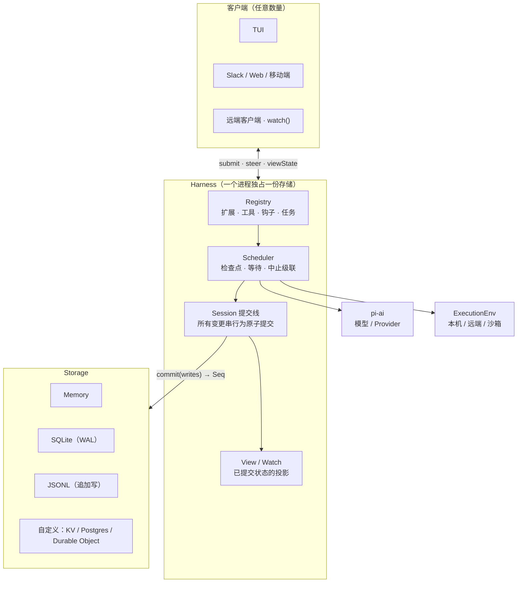
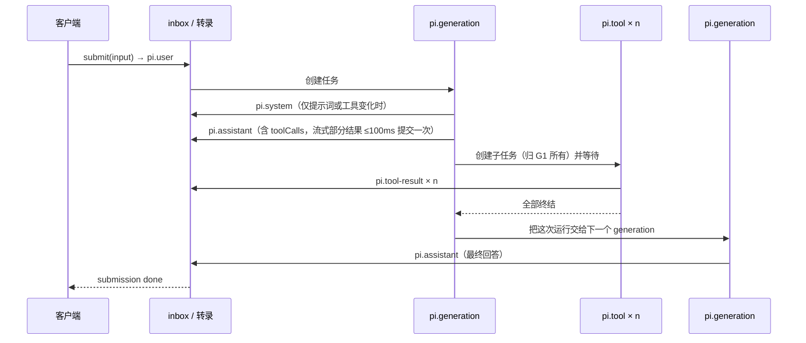
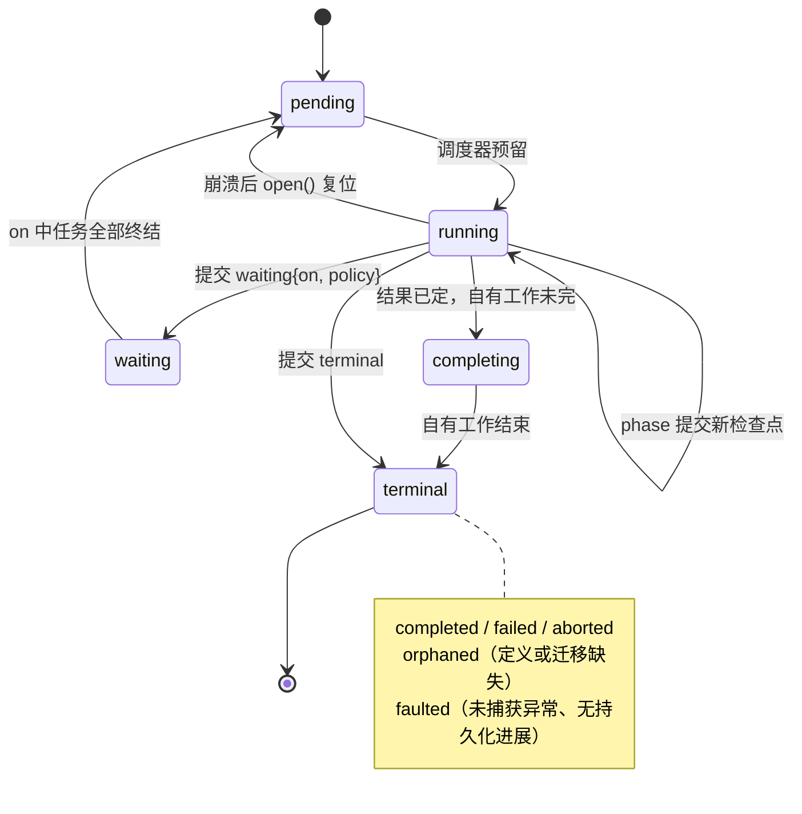
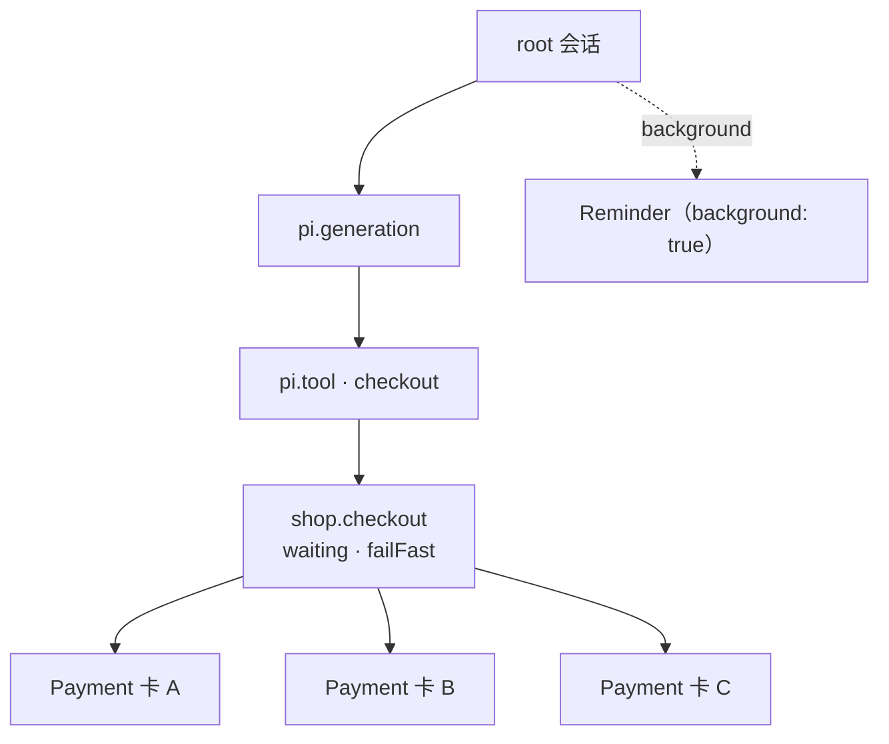
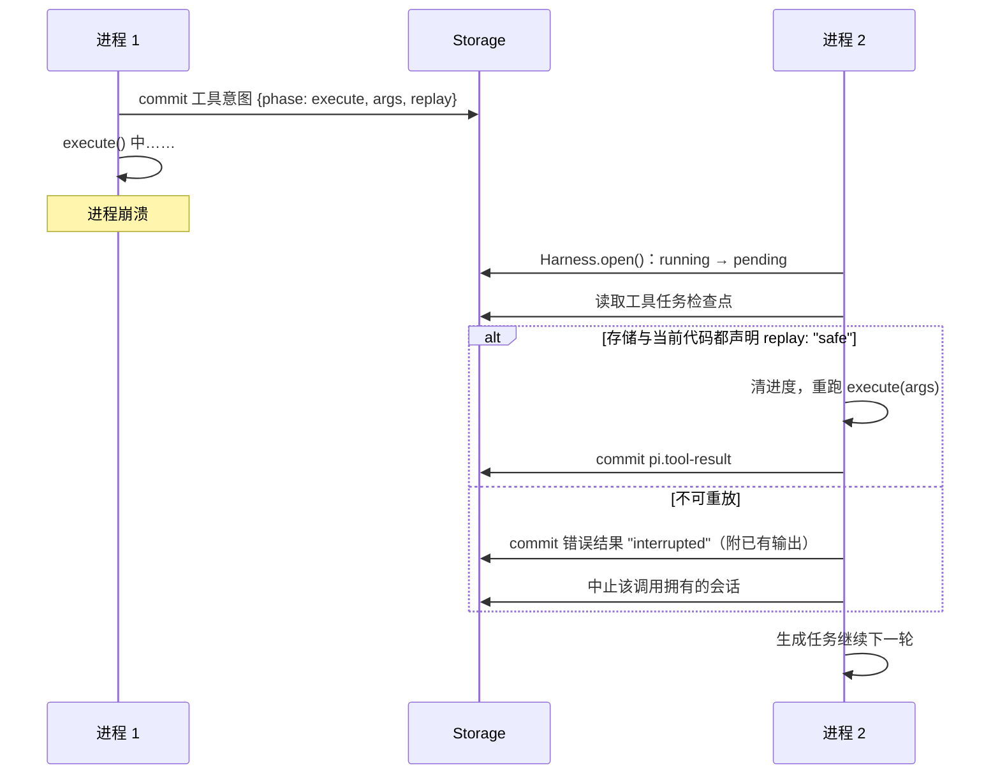
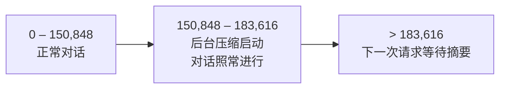

# Pi Durable 技术分析

Created: 2026-10-02
Status: research

> 资料来源：Earendil 博客 [Pi Durable](https://earendil.com/posts/pi-durable/)（2026-10-01，随 Pi 1.0 发布），以及 npm 包 `@earendil-works/pi-durable@1.0.0` 的 `README.md` 与 `dist/` 编译产物。文中凡写「源码」处，均指该包 `dist/` 下的对应文件。包本身标注 **Experimental**，API 可能在版本间无预告变化。

## 结论先行

- Pi Durable 不是 Pi 编码 Agent 的新版本，而是与它并列的一个**通用 Agent harness 框架**。它和编码 Agent 共用 `pi-ai`，也共用「极简、可塑」的原则，可以用来造任何 Agent 应用，编码 Agent 也在其中。
- 整个设计只有一条主轴：**先提交、后可见**。转录是不可变条目，应用状态是和条目同一次提交的文档，所有工作都是每走一步先存检查点的任务。崩溃恢复、fork、多客户端观察、热替换，都归结为「重新读一遍已提交的状态」。
- 它和 Temporal 这类持久执行引擎目标相近，路线不同：Temporal 靠重放事件历史来重建工作流状态，要求工作流代码是确定性的；Pi Durable 要求每个 phase 显式提交完整检查点，恢复时直接从检查点继续，不需要确定性重放。代价是开发者必须自己声明哪些副作用可以重做（`replay: "safe"`），并为外部副作用提供幂等键。
- 对 Pace 而言，它在概念上与 ADR-0040（根 Session 进程隔离、崩溃后不自动重放）、ADR-0042（Pace 作为 Chord 展示宿主）和 ADR-0044（renderer 单写者投影）都有直接交集，值得持续跟踪。但它目前是实验 API，也不在 Pace 锁定的 `pi-coding-agent` 0.99.1 依赖链里，现阶段不宜接入生产路径。

## 1. 它要解决什么问题

博客对两者的分工说得很直白：Pi 编码 Agent 跑在你的（远程）机器上、终端里，由一个人驱动；进程死了，人看一眼发生了什么，再让它继续。Pi 1.0 专注于这件事，也不会改变。

Earendil 想把这项技术带给更多形态的产品，因此需要一个 harness 满足五个条件：

1. 能在任何地方运行（目前指任何有 JavaScript 运行时的地方）；
2. 能从不同表面接入（TUI、Slack、Web……）；
3. 支持无限长的对话；
4. 能扛住内部和外部的灾难性故障；
5. 允许多个人同时驱动同一个 Agent。

博客给 harness 的定义是：**存储，加上运行一个或多个并行 LLM 对话所需的机器**，包括模型可调用的工具，以及工具运行所在的执行环境。harness 运行的一切，从调用模型到执行工具，都是**任务**。

体量上，整个源码不含测试约 15,000 行（博客数据：GPT 约 15 万 token，Claude 约 25 万 token）。其中存储后端约 3,000 行，日常二次开发通常可以跳过。我数了一下 1.0.0 的编译产物，`dist/` 下 JS 共 12,326 行，最大的几个文件依次是 `harness/scheduler.js`（1,178 行）、`testing/storage-conformance.js`（1,153 行）、`env/node.js`（902 行）、`session/transaction.js`（776 行）。复杂度主要集中在调度器。

## 2. 分层结构



几个值得注意的边界：

- **单写者。** README 明确写「One process owns a storage at a time; there is no cross-process locking」。多客户端是 attach 到这个进程，不是多个进程同时写一份存储。
- **执行环境与 harness 分离。** `env` 函数在每次工具调用、每次系统提示词片段渲染时，按会话的 `cwd` 构造环境。于是 harness 可以跑在一台机器上，工具跑在另一台；每个会话也可以有自己的容器（示例 `29-sandbox-per-conversation`）。
- **可移植存储核心。** SQLite 与 JSONL 的核心实现不依赖 Node API，配一个小适配器就能跑在 Bun 或 Cloudflare Durable Object 里。

### 2.1 提交线：整个框架的地基

源码 `session/session.js` 的头注释是「Session kernel: one mutation line, the loaded document tracker cache, and committed publication」。所有写操作都经 `#enqueue` 排进同一条队列，在一个事务里完成后才发布给订阅者。README 的说法是「All changes go through one line of atomic commits, and nothing is shown before its commit is stored」。

这条约束带来三个直接后果：

1. **UI 永远不会看到「已显示但未持久化」的状态。** 崩溃之后重开，看到的就是崩溃前最后一次提交。
2. **跨对象的一致性免费获得。** 一次 `commit()` 可以同时追加条目、修改文档、创建任务，要么全部生效，要么都不生效。待办列表永远不会和产生它的转录对不上。
3. **观察者只需要订阅提交。** 视图、事件流、任务图都是提交的派生物，不需要另一套事件总线。

### 2.2 存储接口很小

`dist/types.d.ts` 里的 `Storage` 接口一共 16 个方法：一个 `commit(writes)`，一个 `mintId()`，一个 `close()`，其余 13 个都是按 ID 查找或分页扫描（会话、条目、任务、提交记录、文档）。写入只有一种形态，即一批 `StorageWrite` 的联合：

```text
conversation | entry | task | submission
document.create | document.copy | document.change | document.retire
```

自定义后端可以直接跑包内的一致性测试套件 `registerStorageConformance`，并配有基准测试。这让「把存储换成 Postgres 或 KV」成为一件边界清晰的工作。

内置后端的持久性要分清：

| 后端 | 持久性 |
|---|---|
| Memory | 不持久化 |
| SQLite | WAL + `synchronous = NORMAL`：进程崩溃时提交不丢；断电或宿主机故障可能丢最新一次提交 |
| JSONL | 追加写；传 `{ fsync: true }` 可在每个提交标记前刷盘 |

SQLite 后端只把**工作集**留在内存：活跃转录、live 任务、待处理提交，其余留在磁盘按需读取。活跃转录天然受模型上下文窗口约束（压缩会在溢出前把旧消息摘要掉），所以几万条消息的对话也能轻松放进内存。

## 3. 数据模型：四类已提交对象

| 对象 | 是什么 | 关键性质 |
|---|---|---|
| Entry（条目） | 转录中的一条不可变记录 | `pi.user`、`pi.assistant`、`pi.tool-result`、`pi.system`、`pi.reset`、`pi.compaction`，或自定义 kind。模型只看到最近一次 reset 或压缩头之后的条目 |
| Document（文档） | 类型化 JSON 状态 | 与条目同一次提交修改。声明 `scope`（session / conversation / task）、`history`（latest / rewindable）和 `fork`（initial / current / asOf） |
| Task（任务） | 持久状态机 | 每个 phase 结束前提交新检查点；有所有者；可等待、可中止 |
| Submission（提交） | 交给会话的输入或写入 | 可等待；带 `requestId` 时保证只提交一次 |

内置文档承载了 UI 需要的一切运行态：`pi.agent`（该会话的模型、思考级别、扩展、工具、指令、cwd）、`pi.live`（正在流式输出的回答、正在跑的工具及其输出、进行中的压缩）、`pi.inbox`（排队的提交）、`pi.usage`（token 与费用）。

一次回答在存储里的样子（来自 README「Concepts」）：



**fork 不复制数据。** fork 出的会话看到父会话到 fork 点为止的条目，然后独立继续，它的 agent 配置取父会话在 fork 点时的值。博客用 Slack 举例：频道是一个会话，某条回复下开出的 thread 是在该条目处的 fork，两者并发运行、互不阻塞，thread 还可以只给「搜索」不给「部署」。

**文档的 fork 语义可声明。** 一个待办文档可以选 `asOf`：fork 继承父会话在 fork 点时的待办，而不是父会话现在的待办。这种细粒度控制在「对话分叉」类产品里很有用。

## 4. 任务：带检查点的状态机

### 4.1 状态与结果

`TaskState` 有五种状态，`TaskOutcome` 有五种结果（`dist/types.d.ts`）：



一个任务定义包含：`name`、`version`、`initial(input)`、穷尽的 `phases` 映射、必须提交终结结果的 `abort`，以及可选的 `migrate`（把旧版本存下的输入和检查点转换成当前版本）。

### 4.2 调度器的几条硬规则

读 `harness/scheduler.js` 能看到博客没展开的契约：

- **重启复位。** `open()` 在一次提交里扫出所有 live 任务，把幸存的 `running` 改回 `pending`。`resume()`（或第一次 submit / wait）才真正开始派发。
- **必须有持久化进展。** 一个 phase 返回时如果检查点与进入时完全相同，任务被判为 `faulted`，报错「returned without durable progress」。这条规则堵住了「phase 做了事却没存检查点」的错误：要么前进，要么失败，不允许原地空转后假装成功。
- **未捕获异常即 faulted。** phase 抛错不会被重试，直接以 `faulted` 终结。需要重试的逻辑（比如模型请求的退避重试）要自己建模成 phase。内置生成任务就有专门的 `retry` 与 `poll` phase。
- **abort 是标记加新调用。** `abort()` 先提交 `abortRequested` 标记；当前调用在下一个决策点结束，等该任务拥有的普通工作都没了，再起一次新调用跑 `abort` 处理器。处理器返回时没有提交终结结果也会 `faulted`。
- **热替换在 phase 边界生效。** 每完成一个 phase，调度器刷新 registry 快照；如果任务定义已被替换且新定义能接手，就把任务放回 `pending`，由新代码继续。

### 4.3 等待与组合

任务可以提交 `waiting` 状态把自己挂起：`on` 列出要等的任务，`policy` 选 `allSettled` 或 `failFast`。挂起期间**不运行任何代码**，也不占内存中的调用。

博客的分卡支付例子把这些机制串了起来：



- 每个 `Payment` 用 `payment-${task.id}` 作为银行侧幂等键扣款，崩溃导致的重跑也只扣一次；
- `Checkout` 的 `pay` phase 在同一次提交里创建三笔支付，并把自己置为 `waiting(failFast)`；
- 卡 B 被拒时，`failFast` 中止 A 和 C，它们各自的 `abort` 处理器负责退款；
- 全部结束后 `Checkout` 进入 `decide` phase，汇总结果。

## 5. 崩溃恢复：逐场景拆解

| 崩溃时刻 | 已落盘 | 新进程的行为 |
|---|---|---|
| submit 刚提交 | Submission 记录、`pi.user`、pending 的生成任务 | 生成任务正常开始；客户端用同一 `requestId` 重试拿回原提交 |
| 模型流式输出中 | `pi.live` 中的部分回答（最多丢最后 100 ms） | 部分回答作为 `stopReason: "aborted"` 的 `pi.assistant` 追加进转录，然后重新发送请求（`harness/generation.js` 的 `convertPartial`） |
| 工具执行中，`replay: "safe"` | 工具任务检查点 `{ phase: "execute", arguments, replay }` | 清掉上次发布的进度，用同样参数重跑 |
| 工具执行中，未声明 replay | 同上 | 不重跑；写入错误结果「was interrupted and may have partially run」（附已提交输出），该调用记为 failed，它拥有的会话被中止，由模型决定下一步 |
| 子代理运行中 | 子会话（归工具调用所有）、其转录与任务、带 `requestId` 的子提交 | 子会话从自己的检查点继续；replay-safe 的子代理工具重跑时用 `scanConversations({ ownerTaskId })` 找回同一个子会话，同一 `requestId` 拿回同一提交 |
| 钩子已拿到人工审批 | 任务上的 memo（先写者胜出） | 钩子重跑时先读 memo，不会再问一遍 |

工具恢复的判断在 `harness/tool.js` 的 `execute` phase，这个 phase 只会在恢复时进入：

```text
if (存储的意图.replay === "safe" && 当前代码的 tool.replay === "safe")
    清理进度 → 重跑
else
    写入 interrupted 错误结果 → 调用以 failed 结束 → 中止它拥有的会话
```

注意这里要求**两边都是 safe**：意图提交时的声明，以及重启后加载的新代码的声明。代码升级把一个工具从 safe 改成 unsafe 时，恢复会走保守路径。



**这套语义对工具作者意味着什么：**

- 声明 `replay: "safe"` 的工具得到的是**至少一次**语义，必须能承受重复执行，只读工具天然满足。
- 未声明的工具得到的是**至多一次**语义，代价是中断后需要模型或人来收尾。
- 想要外部副作用「恰好一次」，只能靠外部系统的幂等键（支付例子里的 `payment-${task.id}`）。框架给了稳定的任务 ID 作为键，但不替你保证外部系统的行为。

## 6. 所有权树：中止与空闲的统一模型

任务和会话构成一棵所有权树。`ownership` 有三种：`ownerless`（独立会话）、`conversation`（会话直接拥有的顶层任务）、`task`（另一个任务拥有，子任务和子代理会话都用这种）。

这棵树统一回答了三个在 Agent 产品里通常各自打补丁的问题：

1. **Esc 中止什么？** 中止会话：撤回排队的输入（排队的写入保留），中止当前工作的全部任务，等会话空闲后返回。
2. **何时算空闲？** 父级只有在它拥有的前台工作都结束后才空闲。完成也一样：一个任务的结果已定但自有工作还在跑，就停在 `completing`，`waitForTask()` 要等到真正终结才返回。
3. **清理顺序？** 自下而上。中止一个任务时先中止它拥有的工作，那些都结束后，它自己的 `abort` 处理器才开始。每个任务只需撤销自己的副作用。

**background 是边界。** 以 `{ background: true }` 创建的任务属于会话，但不属于当前工作：会话可以在它运行时变为空闲，普通中止碰不到它和它拥有的东西。只有直接中止该任务，或 `abort(context, { background: true })` 才会停掉它。这正好对应「比本轮活得更久的子代理」和「明天触发的提醒」。

**子代理不是内置功能。** 博客和 README 都把子代理写成一个工具：在 `api.commit()` 里创建一个归当前调用所有的会话，用 `configure()` 给它更便宜的模型和更少的工具，提交输入并等待答案。因为子代理只是普通会话，它自动获得持久性、独立的用量统计，UI 也能通过调用的 `details` 找到它挂在调用下展示。示例 `23-subagent-background` 演示了常驻子代理：由一个 background 锚点任务拥有，消息由 background 报告任务回传给父会话，`requestId` 保证重启不重复发送。

`harness.taskGraph()` 把所有 live 任务连同所有者边、状态、是否 background、拥有的会话，作为一个可订阅状态暴露，可以直接做任务面板。

## 7. 扩展体系

扩展是一个命名包，可以携带五类东西：`sections`（系统提示词片段）、`tools`、`hooks`、`wraps`（按名字装饰工具或片段）和 `tasks`。应用把扩展装进 Registry；会话选择用哪些扩展、哪些工具，**只存名字**。

### 7.1 系统提示词与提示缓存

系统提示词在每次请求前，由会话所选扩展的片段按顺序重新渲染，会话的 `instructions` 排在最后。变化以位置化的 `pi.system` 条目记进转录，记在发生变化的位置上，因此重启或 fork 看到的正是模型当时看到的内容。对支持对话中途修改系统提示词和工具的模型，只发送差异，提示缓存保持有效。

README 提醒了一个反模式：每次返回不同内容的片段（比如当前时间）会让缓存失效。

### 7.2 工具覆盖与包装

同名工具后装的覆盖先装的（例如一个在 Python virtualenv 里运行的 bash），`wrapTool()` 装饰最终胜出的那一个（例如给任何 bash 计时）。工具拿到的 `api` 能提交条目和文档、创建任务和会话、与其他会话通信，子代理、handoff、历史检索都是在这个能力上几行代码搭出来的。

### 7.3 钩子链

| 钩子 | 所在任务 | 链的语义 | 抛错时 |
|---|---|---|---|
| `beforeTool` | ToolTask | 改写后的参数往下传；第一个 block 终止整条链 | 视为 block |
| `afterTool` | ToolTask | 结果往下传 | 报告后继续 |
| `beforeRequest` | GenerationTask | 替换一次请求的消息 | 报告后继续 |
| `onYield` | GenerationTask | 第一个要求继续运行的钩子胜出 | 报告后继续 |
| `afterResponse` | GenerationTask | 观察者，全部执行 | 报告后继续 |
| `beforeCompact` | CompactionTask | 可拒绝压缩或自己提供摘要 | 报告后继续 |

链的执行顺序就是会话选择扩展的顺序。`beforeTool` 抛错等同于拦截，是一个偏安全的默认：守卫类钩子出故障时宁可拦下调用，也不放行。

**钩子可能重跑。** 钩子运行在任务里，任务可能在崩溃后重跑，所以做决定的钩子要把决定写进 memo。memo 是存在任务上的一个小值，先写者胜出。博客里的部署审批钩子就是先读 `approval:deploy`，读不到才去 Slack 问人，问到后立刻写 memo。

## 8. 压缩与无限长对话

压缩本身是一个任务，在对话继续进行的同时运行。阈值由三个设置决定（默认值见 `harness/agent.js`，算法见 `harness/generation.js`）：

```text
blocking   = contextWindow − reserveTokens       （默认 reserveTokens = 16,384）
background = blocking − backgroundTokens          （默认 backgroundTokens = 32,768）
keepRecentTokens = 20,000                         （大约保留多少最近上下文不摘要）
```

以 200K 上下文窗口为例：



- 进入后台区时启动压缩任务，摘要在下一个轮次边界放入（会话空闲时立即放入）；
- 只有当下一次请求放不下时，对话才等摘要；
- provider 仍报上下文过长时，压缩后重试一次；
- 多个压缩并发时，切点落在当前上下文起点之前的摘要会以 `stale` 结算，切得最远的生效；
- 旧条目永远留在存储里。

`reset()` 走得更远：开启一个新上下文，可带一段 handoff 说明。工具也可以通过返回 `control: { handoff }` 请求同样的效果。因为什么都没删，另一个工具仍能检索 handoff 之前的全部历史。博客用两个工具（`handoff` 加 `search_history`）就做出了「把工作交接给自己、需要时再回查」的 Agent。

## 9. 多人协作与观察

「UI 需要的一切都是已提交状态」这一点，让多客户端几乎不需要额外设计：

| API | 提供什么 | 适合 |
|---|---|---|
| `viewState()` | 只读结构化视图（转录、流式回答、运行中的工具及输出、inbox、agent、用量），每次相关提交后更新 | 同进程 UI |
| `watch()` | 先给当前值，之后每次提交给出精确的 Chord 操作 | 通过 socket 推给远端客户端 |
| `watchEvents()` | 把提交翻译成编码 Agent 风格事件（`message_update`、`tool_execution_start` 等，带增量） | 已有事件驱动 UI 的迁移 |

几个工程参数（源码可查）：

- 部分回答和工具输出最多每 100 ms 提交一次（`PARTIAL_THROTTLE_MS`、`MIN_PROGRESS_INTERVAL_MS`），工具输出另有约 100 KiB/s 的写入节流。崩溃最多丢这一个窗口。
- 慢 watch 最多积压 100 帧（`MAX_PENDING_WATCH_FRAMES`），超出后待发送帧被替换为一帧完整的最新视图。事件流落后超过 100 批则收到新的 `snapshot` 事件。
- 迟到或重连的客户端从当前视图开始，**不回放历史**。

这意味着客户端必须按「状态加增量」建模，而不是依赖不丢事件的事件溯源。

忙碌会话的提交语义：

| 提交方式 | 何时进入对话 |
|---|---|
| follow-up（默认） | 本次运行回答后，开启下一次运行 |
| `whenBusy: "steer"` | 当前工具轮结束后插入，加入正在进行的运行 |
| `whenBusy: "reject"` | 抛 `ConversationBusy` |
| `type: "write"` | 追加条目，不询问模型 |

运行失败时，排队项留在 inbox 里，等下一次提交时按先后放入。

## 10. 可塑性：运行中改代码

Registry 可以在会话运行时变化：以已安装的名字再装一次扩展，就是一步原地替换。已经在跑的工具调用用开始时的代码跑完，下一次调用用新代码。由于会话只存扩展名和工具名，重启后自然使用新进程安装的代码；某个扩展被卸载，选了它的会话只是暂时拿不到它，重新安装后恢复。

粒度要说清：每个任务 phase 在开始时从 registry 解析一次钩子和 agent，因此替换在 **phase 边界**生效，而不是函数调用边界。待恢复的扩展任务要等其扩展重新安装后才会继续；找不到定义的任务在被中止时以 `orphaned` 结算，`harness.inspect()` 可以报告哪些任务因缺定义而阻塞。

## 11. 设计取舍与风险

**有意的取舍：**

- **单进程独占存储，没有跨进程锁。** 换来了简单的提交线和强一致性，代价是水平扩展要在上层做：按会话或租户分片到多个 harness，而不是多个进程共享一份存储。
- **检查点而非重放。** 不要求确定性，phase 代码可以自由调用外部 API；但开发者要对「phase 粒度」负责：两次检查点之间的副作用，在崩溃后可能执行一次也可能执行两次。
- **没有内置子代理、没有内置审批。** 框架只给原语（所有权、memo、`requestId`），产品策略留给扩展。这符合 Pi 的极简传统，也意味着「最佳实践」暂时主要靠示例传播。

**需要注意的风险：**

- **实验 API。** README 第一行就写着 API 会无预告变化。
- **replay 声明的正确性没有机器检查。** 把一个有副作用的工具误标为 `safe`，崩溃后就会重复执行。
- **SQLite 默认 `synchronous = NORMAL`。** 断电或宿主机故障时可能丢最新一次提交，对金融类副作用要配合外部幂等。
- **观察可能丢中间帧。** 慢客户端会被「跳到最新」，需要完整审计轨迹的场景应直接读存储，而不是依赖 watch。
- **包体积。** README 提到根入口会加载 TypeBox（参数校验用），未打包时峰值 RSS 约多 23 MB，tree-shaking 后约 4 MB。

## 12. 对 Pace 的启示

先说事实边界：

- Pace 当前锁定 `@earendil-works/pi-coding-agent` 与 `pi-ai` 0.99.1（`packages/backend/package.json`）。
- npm 上的 `pi-coding-agent` 1.0.0 不依赖 `pi-durable`，也不发布 `experimental` 目录；博客里的 durable 版编码 Agent 和度假规划器 demo 只存在于 Pi 源码仓库（`packages/coding-agent/src/experimental/`）。
- 所以 Pace 今天的 Session 执行路径与 Pi Durable 没有任何依赖关系。

在此基础上，几处值得对照的地方：

| Pace 现有决策 | Pi Durable 的对应做法 | 启示 |
|---|---|---|
| ADR-0040：单个根进程异常退出只让该 Session 失败，下次明确操作才恢复，不自动重放未完成任务 | 每步检查点，`resume()` 自动续跑，工具按 replay 声明决定重跑或报中断 | 如果将来要提供「崩溃后自动继续」，问题不在 Pace，而在 Pi 侧是否有任务级检查点。Pace 自己在 Pi 编码 Agent 之上补检查点，大概率会和 Pi 的 JSONL 真相来源冲突 |
| ADR-0040：子代理生命周期归插件所有，Pace 不维护子代理树 | 子代理是归工具调用所有的会话；`taskGraph()` 暴露整棵所有权树 | 若上游编码 Agent 迁移到 Durable，Pace 去掉的子代理观察可以零协议地回来：直接订阅任务图 |
| ADR-0042：Pace 作为 Chord 展示宿主 | Durable 的文档状态与 watch 操作就是 Chord 状态和操作 | 两条线用的是同一套复制状态原语，Pace 在 Chord 传输适配上的投入可以复用 |
| ADR-0044：renderer 内单写者 Session 投影 | 「UI 需要的一切都是已提交状态」，`watch()` 给出每次提交的精确操作 | 思路一致：UI 只消费投影，不自行推断。Durable 的「慢客户端跳到最新视图」策略可以作为 Pace 投影背压设计的参考 |
| ADR-0012：输入区暴露 steer 与 queue | inbox 的 steer / follow-up / write / reject 四种语义 | 术语和语义基本对齐，未来接入时 UI 层改动应该很小 |

**建议：** 现阶段只跟踪、不接入。可以做的低成本动作有两个：一是在 `.scratch/` 下做一个一次性 spike，用 `MemoryStorage` 或 SQLite 跑通 `watch()` 到 renderer 的投影，验证它与 ADR-0044 投影模型的贴合度；二是关注上游 `packages/durable/docs/spec.md`（规范性文档）与编码 Agent 的 experimental durable 入口何时进入发布物，那是 Pace 需要真正决策的时间点。

## 参考

- Earendil Engineering，[Pi Durable](https://earendil.com/posts/pi-durable/)，2026-10-01
- `@earendil-works/pi-durable@1.0.0`：`README.md`、`dist/types.d.ts`、`dist/session/session.js`、`dist/harness/scheduler.js`、`dist/harness/tool.js`、`dist/harness/generation.js`、`dist/harness/agent.js`、`dist/harness/output.js`、`dist/session/observation.js`
- 上游设计文档（未在本文中逐条核对）：[`packages/durable/docs/spec.md`](https://github.com/earendil-works/pi/blob/main/packages/durable/docs/spec.md)、[`pico-v5-handoff.md`](https://github.com/earendil-works/pi/blob/main/packages/durable/docs/pico-v5-handoff.md)、[`pico-v5-chord-usage.md`](https://github.com/earendil-works/pi/blob/main/packages/durable/docs/pico-v5-chord-usage.md)
- 本仓库：[ADR-0040](https://github.com/bubbleptr/pace/blob/2315db6/docs/adr/0040-root-session-process-isolation.md)、[ADR-0042](https://github.com/bubbleptr/pace/blob/2315db6/docs/adr/0042-pace-as-chord-presentation-host.md)、[ADR-0044](https://github.com/bubbleptr/pace/blob/2315db6/docs/adr/0044-single-writer-session-projection-in-renderer.md)、[ADR-0012](https://github.com/bubbleptr/pace/blob/2315db6/docs/adr/0012-live-session-input-exposes-steer-and-queue.md)
