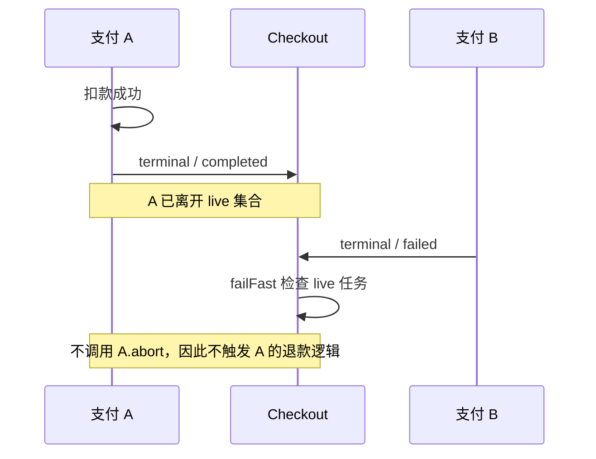

# Pi Durable 1.0.0：恢复与事务边界核查

核查日期：2026-10-02。本文是技术分析的证据笔记；结论限定于发布包 `@earendil-works/pi-durable@1.0.0`。除了支付调度的最小复现，其余结论来自源码阅读，不代表已做故障注入或完整生产验证。

## 版本与证据

[官方文章](https://earendil.com/posts/pi-durable/)发表于 2026-10-01。[npm 固定版本元数据](https://registry.npmjs.org/@earendil-works/pi-durable/1.0.0)记录 `gitHead = a13d35a742c6ef8462812a28fbe1d8c8b7431c32`。本文源码链接均锁定该提交；执行复现使用[官方 1.0.0 发布包](https://registry.npmjs.org/@earendil-works/pi-durable/-/pi-durable-1.0.0.tgz)。本地下载包 SHA-1 为 `82596ad7fc3d33441ffb67ded915e3c7fa4e0e49`，与元数据一致。

## 恢复究竟恢复什么

| 核查点 | 实际保证 | 证据 |
| --- | --- | --- |
| 工具先记录意图 | 验参、`beforeTool` 完成后，先提交 `phase: execute`、最终参数和当时的 replay 策略，才调用工具。 | [tool.ts 85–91 行](https://github.com/earendil-works/pi/blob/a13d35a742c6ef8462812a28fbe1d8c8b7431c32/packages/durable/src/harness/tool.ts#L85-L91) |
| replay 的双重门槛 | 已存策略与当前工具定义都为 `safe` 才重跑。否则写入 `interrupted`，承认工具可能只执行了一部分。`safe` 是工具作者的契约，框架不会证明外部副作用幂等。 | [tool.ts 93–110 行](https://github.com/earendil-works/pi/blob/a13d35a742c6ef8462812a28fbe1d8c8b7431c32/packages/durable/src/harness/tool.ts#L93-L110) |
| phase checkpoint | 重新打开时，存活的 `running` 变回 `pending`，保留 checkpoint；调度器按 `checkpoint.phase` 调用 phase handler。恢复的是显式状态机位置，不是 JavaScript 调用栈或某个 `await` 的下一行。 | [scheduler.ts 230–252 行](https://github.com/earendil-works/pi/blob/a13d35a742c6ef8462812a28fbe1d8c8b7431c32/packages/durable/src/harness/scheduler.ts#L230-L252)、[867 行](https://github.com/earendil-works/pi/blob/a13d35a742c6ef8462812a28fbe1d8c8b7431c32/packages/durable/src/harness/scheduler.ts#L867) |
| 模型流中断 | 重新进入 `request` 时，先把已提交 partial 转成 `stopReason: aborted` 的记录，然后重新发模型请求；不是从最后一个 token 续传。partial 按 100ms 节流提交，所以进程崩溃可能丢失尚未提交的尾部。 | [generation.ts 184–208 行](https://github.com/earendil-works/pi/blob/a13d35a742c6ef8462812a28fbe1d8c8b7431c32/packages/durable/src/harness/generation.ts#L184-L208)、[351–406 行](https://github.com/earendil-works/pi/blob/a13d35a742c6ef8462812a28fbe1d8c8b7431c32/packages/durable/src/harness/generation.ts#L351-L406) |
| 留档与模型上下文 | aborted partial 留在 transcript；派生模型上下文时排除 assistant 的 `aborted`、`error`、`deferred` 消息。 | [context.ts 8 行、77–79 行](https://github.com/earendil-works/pi/blob/a13d35a742c6ef8462812a28fbe1d8c8b7431c32/packages/durable/src/harness/context.ts#L77-L79) |
| `requestId` | 去重键是 `(conversationId, requestId)`。同会话同键返回原 submission；类型不同报错，但相同类型不比较正文。调用方必须让键稳定地对应同一业务意图。它不保证工具或银行请求只执行一次。 | [submissions.ts 155–163 行](https://github.com/earendil-works/pi/blob/a13d35a742c6ef8462812a28fbe1d8c8b7431c32/packages/durable/src/harness/submissions.ts#L155-L163) |

模型的 deferred/poll 是单独路径：已经存下 provider handle 后可以继续 poll。因此“重新发送模型请求”具体指中断在流式 `request` phase 的情况，不宜写成所有模型工作都会重新创建请求。[generation.ts](https://github.com/earendil-works/pi/blob/a13d35a742c6ef8462812a28fbe1d8c8b7431c32/packages/durable/src/harness/generation.ts)

## 存储事务与外部副作用之间仍有裂缝

一次 commit 可以把 entry、document、task 状态一起存储。实现先执行事务回调、收集 writes，再调用 `storage.commit`，成功后才更新内存并发布。SQLite 后端把表和 document 修改放在同一个数据库事务内。[session.ts 404–443 行](https://github.com/earendil-works/pi/blob/a13d35a742c6ef8462812a28fbe1d8c8b7431c32/packages/durable/src/session/session.ts#L404-L443)、[SQLite 后端源码](https://github.com/earendil-works/pi/blob/a13d35a742c6ef8462812a28fbe1d8c8b7431c32/packages/durable/src/storage/sqlite/storage.ts)

**推论：这不是数据库和银行之间的分布式事务。** 银行已扣款、checkpoint 尚未提交时崩溃，phase 会重跑；把 `bank.charge()` 写进 commit 回调也不会让银行加入本地事务。需要外部系统认可的幂等键、结果查询及显式补偿；博客支付例本身也为扣款传入基于 task ID 的幂等键。[官方支付例](https://earendil.com/posts/pi-durable/#tasks)

**部署边界是一个 storage 同时由一个进程持有。** 这是官方文章明确给出的约束；源码中的 Session promise 队列只把本 Session 的提交串行化，不能据此宣称提供多进程 leader election、租约或跨进程 fencing。多个 conversation 的异步任务可以并发，持久提交仍走这条串行通道。[官方说明](https://earendil.com/posts/pi-durable/#long-runs-anywhere)、[session.ts 529–536 行](https://github.com/earendil-works/pi/blob/a13d35a742c6ef8462812a28fbe1d8c8b7431c32/packages/durable/src/session/session.ts#L529-L536)

## 支付示例：failFast 不等于完整退款

博客描述一张卡失败后其他支付取消并退款。但该示例让成功扣款的 Payment 立即提交 `terminal/completed`。1.0.0 的调度器有三个相关行为：

1. `terminal` 任务立即移出 `#live`。[scheduler.ts 358–366 行](https://github.com/earendil-works/pi/blob/a13d35a742c6ef8462812a28fbe1d8c8b7431c32/packages/durable/src/harness/scheduler.ts#L358-L366)
2. `failFast` 仅标记等待集合中还在 `#live` 的其他非失败任务。[scheduler.ts 461–468 行](https://github.com/earendil-works/pi/blob/a13d35a742c6ef8462812a28fbe1d8c8b7431c32/packages/durable/src/harness/scheduler.ts#L461-L468)
3. 对 `terminal` 调用 `abort()` 直接返回，不执行用户的 abort handler。[scheduler.ts 273–278 行](https://github.com/earendil-works/pi/blob/a13d35a742c6ef8462812a28fbe1d8c8b7431c32/packages/durable/src/harness/scheduler.ts#L273-L278)

因此，A 先成功并终结、B 后失败时，**A 不会因为父任务的 failFast 自动退款**。取消树用于未完成工作及其清理，不会重新打开已经完成的任务执行 Saga 补偿。这是示例保障过强，不能据此认定框架的取消机制本身有 bug。



**已运行确定性复现。** 脚本使用真实发布包中的 `TaskScheduler`、`SessionImpl`、`MemoryStorage`，registry 仅提供三个自定义任务定义；B 通过 `waitForTask(A)` 等待 A 完成后再失败。没有银行请求、模型调用或时间休眠。随后还显式 abort A，确认不会调用补偿。

```text
$ node /tmp/pi-durable-evidence-20261002/failfast-repro.mjs
{
  "parent": "failed",
  "A": "completed",
  "B": "failed",
  "A_abort_calls": 0,
  "explicit_abort_A": "terminal"
}
# exit code: 0
```

建议的应用设计：由 Checkout 持久记录成功支付的 receipt；任一卡失败后，显式创建幂等的退款任务并等待其结果；对“银行成功、本地未知”的支付先查询再决定补偿。该建议是从事务边界推导出的应用层方案，不是 Pi Durable 已内建的能力。
