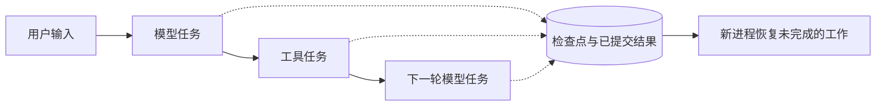
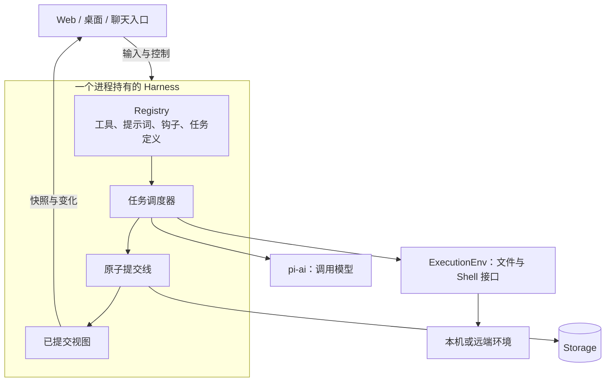
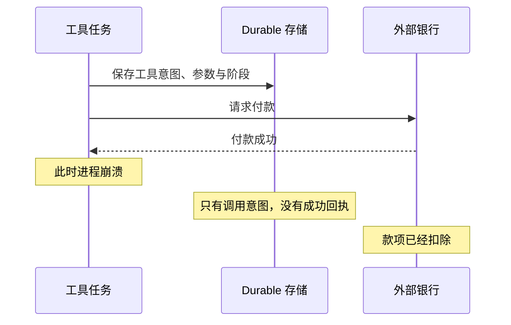
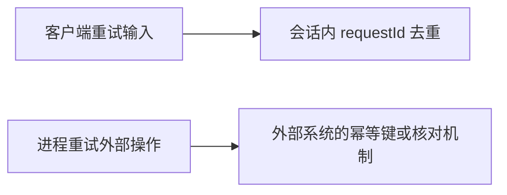
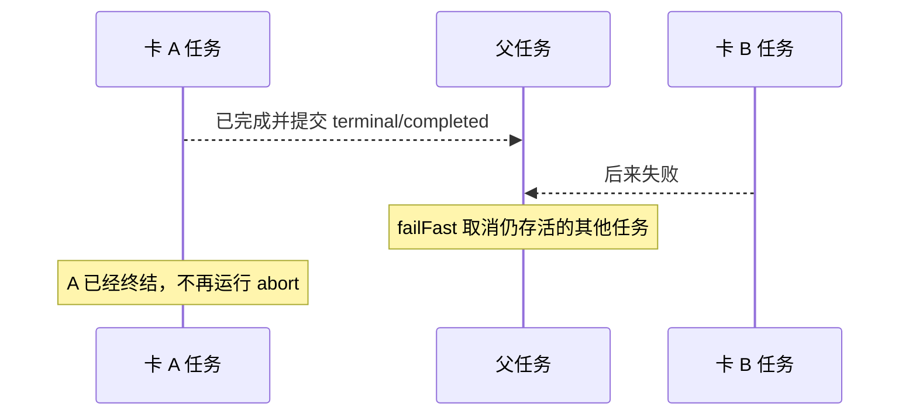
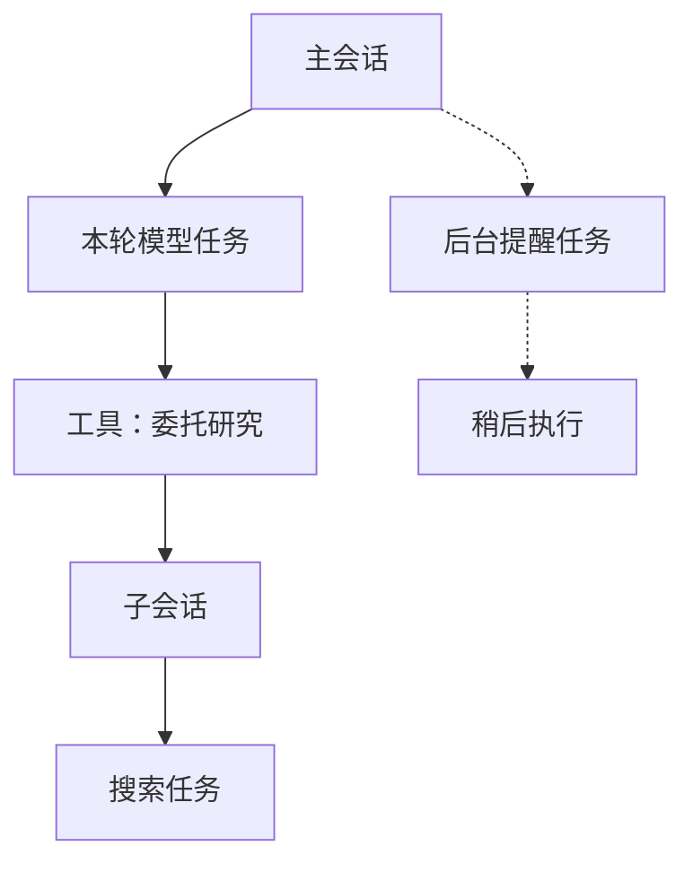
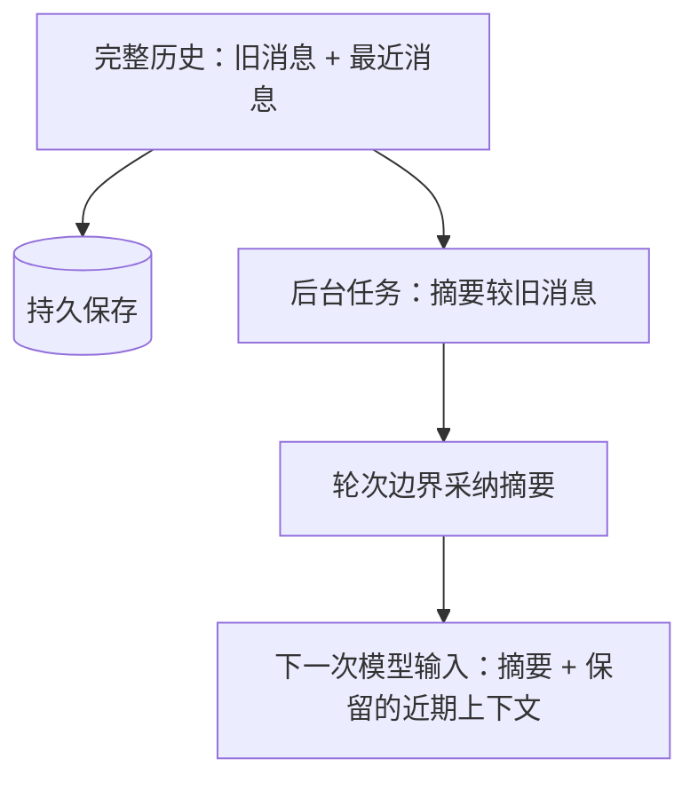
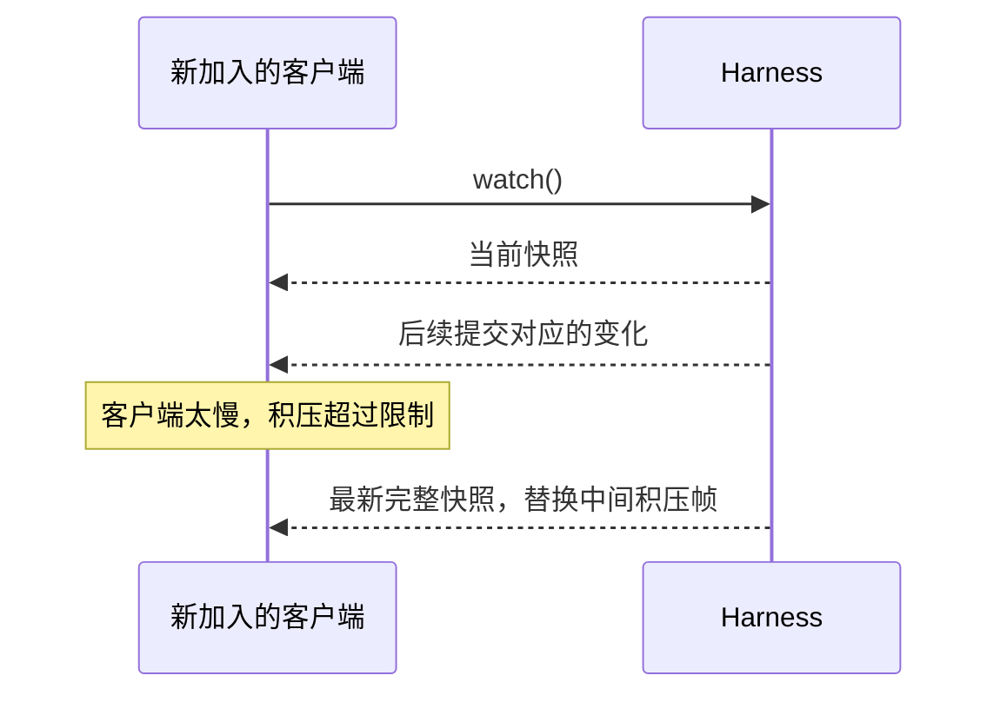

# Pi Durable 图解：Agent 中断以后，工作怎样继续

研究日期：2026-10-02。发布背景来自 Earendil 2026-10-01 的介绍；实现核对以 `@earendil-works/pi-durable@1.0.0` 发布包为准。下文链接到固定版本的 JavaScript 实现，避免把不断变化的 `main` 当成版本承诺。本文是技术分析，不是接入方案或已经运行的产品示例。

## 先把 durable 理解成“工作进度可以恢复”

想象一个 Agent 正在查天气、订火车、整理行程。笔记本突然关机。重开之后，应用不仅要找回聊天记录，还得回答：哪些查询已经结束？哪次请求只完成了一半？车票到底订了没有？

Pi Durable 把这些问题纳入执行模型：**会话里的工作由持久任务驱动，任务在明确的边界保存检查点。新进程读取这些记录，决定接下来做什么。** 它是与 Pi coding agent 并存的通用 Agent 框架，共用 `pi-ai` 等基础设施；官方仍把它标为实验性 API。[发布介绍](https://earendil.com/posts/pi-durable/)、[1.0.0 README](https://unpkg.com/@earendil-works/pi-durable@1.0.0/README.md)

图里的箭头代表执行边界。JavaScript 调用栈不会被存进数据库，一个执行到一半的函数也不会从原来的某一行神奇地接着跑。恢复依据是任务保存的阶段、输入和状态。这一点决定了后面所有取舍。[任务类型](https://unpkg.com/@earendil-works/pi-durable@1.0.0/dist/types.d.ts)、[调度器](https://unpkg.com/@earendil-works/pi-durable@1.0.0/dist/harness/scheduler.js)

## 1. 架构的中心是一条提交线

模型请求、工具执行、自定义后台任务，都进入任务体系。需要文件或 Shell 的工具通过 `ExecutionEnv` 访问本机或远端环境，远端适配器由应用提供。工具函数仍由 Harness 调用，自定义工具也可以直接调用外部 API。模型和工具能够并发工作，持久状态变更经过串行的提交线。[Harness 实现](https://unpkg.com/@earendil-works/pi-durable@1.0.0/dist/harness/harness.js)、[环境接口](https://unpkg.com/@earendil-works/pi-durable@1.0.0/dist/env/index.d.ts)

提交线的关键顺序是：准备变更，交给 Storage，确认提交，再让观察者看见。这使 UI 有了稳定的依据。已经发布的应用状态与框架认可的已提交状态一致，重连也可以重新取得同一份视图。[Session 内核](https://unpkg.com/@earendil-works/pi-durable@1.0.0/dist/session/session.js)

一次提交可以包含几种不同对象：

| 对象 | 回答的问题 | 示例 |
| --- | --- | --- |
| Entry | 对话中发生过什么？ | 用户输入、模型回答、工具结果 |
| Document | 应用现在是什么状态？ | 待办、配置、正在流式输出的内容 |
| Task | 工作执行到哪里？ | 正在请求模型、等待子任务、准备下一阶段 |
| Submission | 某次输入被接收、处理了吗？ | 重连后找回同一条输入 |

例如，应用可以在一次事务里更新待办文档、追加说明条目、创建后续任务。原子性覆盖的是**放进同一次提交的这些变更**。如果开发者主动拆成两次提交，中间状态依然存在；在事务回调里调用外部 API，也不会把那个 API 变成本地事务的一部分。[事务实现](https://unpkg.com/@earendil-works/pi-durable@1.0.0/dist/session/transaction.js)

## 2. 最重要的图：外部成功，本地还不知道

以付款工具为例，最棘手的时间点在这里：

本地存储的状态不足以判断外部是否成功。Pi Durable 用明确的重跑策略处理这个不确定性，工具意图在执行前提交；恢复时，保存的意图和当前工具定义必须都声明 `replay: "safe"`，才会再次执行。缺少其中任意一项，就记录中断结果，交给模型继续处理。[工具任务实现](https://unpkg.com/@earendil-works/pi-durable@1.0.0/dist/harness/tool.js)

| 崩溃中的工作 | 恢复后的行为 | 工具作者承担什么 |
| --- | --- | --- |
| 模型流式回答 | 保存过的部分回答标记为中断，重新请求模型 | 不能假定新答案与旧答案相同 |
| 可重跑的搜索 | 再执行这次搜索 | 能接受重复读取和结果变化 |
| 未声明安全的部署 | 不自动重跑这个工具调用，返回中断信息 | 查询实际部署状态，再决定下一步 |
| 使用稳定幂等键的付款 | 允许再次请求，由银行识别同一业务操作 | 确认银行的幂等作用域和有效期 |
| 无幂等保护，却标成安全的付款 | 框架仍会重跑，可能重复扣款 | 修正错误的工具契约 |

模型恢复分支可见 [generation.js](https://unpkg.com/@earendil-works/pi-durable@1.0.0/dist/harness/generation.js)。表中付款、部署是机制示例，没有调用真实服务。

`replay: "safe"` 是作者的承诺，不是系统做出的副作用安全证明。同样，`requestId` 解决的是同一会话里重复提交输入的问题。实现先在该会话查找已有 request ID，有记录就返回原 Submission；它不负责让任意外部工具恰好执行一次。[Submission 实现](https://unpkg.com/@earendil-works/pi-durable@1.0.0/dist/harness/submissions.js)

可以把可靠性分成两个独立问题：

不自动重跑，也只约束这次工具调用的恢复。后续模型仍可能生成一个新的调用，因此不能把默认策略宣传成业务层面的“最多部署一次”。

### 一个必须修正的示例理解

原文用分卡付款演示 `failFast` 和 `abort` 退款。这个例子能说明取消传播，却不能保证整笔订单失败后所有已成功付款都会退款。

1.0.0 的调度器把 terminal 任务移出 live 集合，`failFast` 只对仍在集合中的任务请求中止。直接中止 terminal 任务也会立即返回。本次用真实 Session、Scheduler 和 MemoryStorage 做了确定性复现：先确保 A 完成，再让 B 失败，结果为 `A=completed`、`B=failed`、`A_abort_calls=0`。[调度器实现](https://unpkg.com/@earendil-works/pi-durable@1.0.0/dist/harness/scheduler.js)、[复现与行号记录](./pi-durable-evidence.md)

如果产品需要整单补偿，应在父工作流里持久记录成功付款，并显式创建退款工作；退款也要考虑重复执行与失败。**取消未完成的工作，与补偿已经完成的工作，是两个不同动作。** 这是本文基于实现与复现得到的工程判断。

## 3. 检查点让任务可组合，也要求开发者划清阶段

任务定义包含初始状态、阶段处理器、版本和中止处理器。一个阶段提交下一检查点、进入等待，或终结任务。调度器在阶段返回后检查是否产生持久进展；没有进展的执行会被判为 faulted。未捕获异常也不会自动变成无限重试。[任务定义](https://unpkg.com/@earendil-works/pi-durable@1.0.0/dist/tasks.d.ts)、[调度器](https://unpkg.com/@earendil-works/pi-durable@1.0.0/dist/harness/scheduler.js)

这里指阶段提交 `waiting` 状态后返回，调度器便不需要保留该阶段的挂起调用。提交本身不会强行终止 JavaScript handler；普通 `await waitForTask()` 也不能直接等同于这种持久等待。

这种显式状态机的好处是恢复点可见，缺点也是显式：阶段拆分需要人设计。一个阶段塞入越多外部操作，崩溃后越难判断重跑是否安全。相反，为每个纯计算步骤都保存检查点，又会增加写入与状态迁移负担。

我倾向于在外部副作用、长时间等待和任务扇出的位置划边界。它们是重启后最需要重新判断的地方。这是设计建议，不是框架强制规定。

## 4. 子代理、取消和分叉，各有自己的关系

Pi Durable 可以用工具创建子会话，并把子会话归属到创建它的任务。于是子代理沿用普通会话的恢复和统计机制。一个安全重跑的子代理工具还需要找回已有子会话，并用稳定 `requestId` 找回原输入，避免重启后再造一个子代理。[事务创建会话](https://unpkg.com/@earendil-works/pi-durable@1.0.0/dist/session/transaction.js)、[Submission 去重](https://unpkg.com/@earendil-works/pi-durable@1.0.0/dist/harness/submissions.js)

实线代表当前前台工作的所有权关系。取消沿所有权传播，并先处理子工作，再运行父任务的中止逻辑。后台任务形成另一条生命周期边界：会话可以在它运行时变为空闲，普通取消不会越过它；显式取消后台任务或使用包含后台工作的中止选项仍能停止它。[所有权与取消实现](https://unpkg.com/@earendil-works/pi-durable@1.0.0/dist/harness/scheduler.js)

**所有权回答“谁负责停止谁”，并不回答“谁有权限读什么”。** 多用户产品仍需自行定义访问控制。

Fork 则回答历史继承问题。子会话可以引用父会话在分叉点之前的 transcript，然后独立继续；应用文档的继承策略需要单独声明。[Fork 实现](https://unpkg.com/@earendil-works/pi-durable@1.0.0/dist/session/forks.js)

| 文档策略 | 子会话开始时拿到什么 | 适用示例 |
| --- | --- | --- |
| `asOf` | 分叉条目所在提交的历史状态，需要 rewindable history | 回到当时的计划 |
| `current` | 分叉发生时父会话的当前已提交状态 | 沿用最新设置 |
| `initial` | 不复制，首次访问时初始化 | 新会话自己的临时状态 |

复制后的会话文档独立变化，已有运行任务不会一起复制。画产品架构图时，应分别画“历史来自哪里”和“取消由谁负责”；把它们压成一条 parent 连线，会让 fork 与子代理行为混淆。

## 5. 长对话依赖后台压缩，旧记录继续保留

Compaction 也是持久任务。接近上下文预算时先在后台做摘要；到下一请求装不下时，才必须等待摘要。会话正在运行时，摘要在轮次边界进入上下文。旧条目继续留在存储中。[压缩任务](https://unpkg.com/@earendil-works/pi-durable@1.0.0/dist/harness/compaction.js)、[上下文预算与阻塞判断](https://unpkg.com/@earendil-works/pi-durable@1.0.0/dist/harness/generation.js)

因此，“长期运行”不意味着模型同时记得无限历史。摘要会损失细节，产品可以另做历史检索工具，在需要时查回原始记录。`reset` 与 handoff 可以进一步开始新的模型上下文；保留历史与缩小本轮输入可以同时成立。

这也解释了为何框架把 transcript 与当前视图分开：保存多少历史，是存储问题；这轮给模型看多少，是上下文管理问题。

## 6. 多客户端共享的是已提交视图

`watch()` 先提供当前视图，随后传递 Chord 操作。1.0.0 的观察实现限制待发送队列；过载后改送最新完整视图。由此能做迟到加入、断线重连与多端观看，但消费者不能把这个流当作永不丢失中间记录的审计总线。[观察实现](https://unpkg.com/@earendil-works/pi-durable@1.0.0/dist/session/observation.js)

类似地，`taskGraph()` 适合显示当前仍存活的任务；任务终结后离开图。它给产品实时任务拓扑，不直接提供完整历史工作流图。[任务图实现](https://unpkg.com/@earendil-works/pi-durable@1.0.0/dist/harness/task-graph.js)

我的判断是，这个状态优先的接口非常适合 Agent 工作台：客户端可以重新取得权威状态，少依赖自己拼接事件后的猜测。代价是审计、计费流水等需求必须选择对应的持久记录来源，不能顺手把 UI 更新流当成账本。

## 7. 可塑性和持久性之间，有版本管理这道边界

会话保存扩展与工具的名字，代码由当前进程的 Registry 提供。替换同名扩展后，新工作使用新定义，已经开始的工具调用保留原实现。这样可以在运行中更新工具或提示词。[Registry 实现](https://unpkg.com/@earendil-works/pi-durable@1.0.0/dist/harness/registry.js)

但是，旧任务保存的检查点仍是旧数据。任务版本升级需要迁移逻辑；缺定义或迁移失败会阻塞恢复。文档也有版本迁移契约。存活时间越长，这个问题越难绕开。[任务迁移](https://unpkg.com/@earendil-works/pi-durable@1.0.0/dist/harness/scheduler.js)、[文档迁移](https://unpkg.com/@earendil-works/pi-durable@1.0.0/dist/documents.js)

部署方案还必须区分这些能力边界：

| 期待 | 1.0.0 的实际边界 |
| --- | --- |
| 多人同时接入 | 多客户端连接一个持有存储的进程；没有跨进程锁 |
| 任意进程崩溃恢复 | 需要重新启动进程、打开可用的持久存储，并恢复调度 |
| 内存后端也能跨重启 | MemoryStorage 随进程丢失，适合测试与示例 |
| 默认存储抵抗所有故障 | SQLite 默认 WAL + NORMAL；进程崩溃与断电耐久性有区别 |
| 换成 Postgres 就能多写者 | 更换存储不会自动改变框架的单写者契约 |

存储条件来自 [README Storage](https://unpkg.com/@earendil-works/pi-durable@1.0.0/README.md)、[Node SQLite 适配器](https://unpkg.com/@earendil-works/pi-durable@1.0.0/dist/storage/sqlite/node.js)。表中的 SQLite 默认配置指这个内置 Node 适配器。最后一行是由单写者契约推导出的部署结论。框架恢复能力也不等于它包含了进程监督、鉴权、备份与灾难恢复的完整产品方案。

## 8. 对 Pace 的价值，在于可以借鉴的契约

Pace 当前的路径是 Pi coding-agent SDK → Normalizer → Runtime Gateway → Journal/Projection。根 Session 在独立进程中运行，Pi 自己的会话日志负责上下文真相。Durable 则拥有另一套 conversations、tasks、documents 和 submissions，并从自己的 Storage 恢复工作。两者的接入边界不同。[Pace 架构](https://github.com/bubbleptr/pace/blob/2315db6/README.md#architecture)、[SDK adapter](https://github.com/bubbleptr/pace/blob/2315db6/packages/backend/src/drivers/pi-sdk-runtime-adapter.ts)、[当前依赖](https://github.com/bubbleptr/pace/blob/2315db6/packages/backend/package.json)

因此，我不会把 Durable 看成替换一个 import 就能接入的升级。是否采用它，需要明确持久状态归谁、会话身份怎样映射、进程退出怎样恢复、现有扩展怎样运行。共享 Chord 概念只能提供研究线索；Pace 的 [ADR-0042](https://github.com/bubbleptr/pace/blob/2315db6/docs/adr/0042-pace-as-chord-presentation-host.md) 仍是草案，而且其边界并不等于替换 PiRuntimeDriver。

更值得借鉴的是这些可以逐项验证的契约：

- 输入需要稳定身份，让重连重试找回同一次请求。
- 展示状态有权威快照，客户端落后时可以重新同步。
- “取消本轮”和“停止后台工作”有清楚的产品语义。
- 自动恢复必须依据工具副作用契约，不能只因为进程又启动了。

如果继续评估，最有价值的下一步是一个隔离实验：工具调用中途退出进程，再检查重跑、重连、取消和迁移分别发生了什么。支付补偿的复现已经说明，故障时序能揭示演示代码没有覆盖的边界。

## 资料与核验范围

- [Earendil 发布介绍](https://earendil.com/posts/pi-durable/)用于产品动机和术语定位；[固定版本包](https://www.npmjs.com/package/@earendil-works/pi-durable/v/1.0.0)与文中的实现链接用于机制核对。
- 当前[上游源码](https://github.com/earendil-works/pi/tree/main/packages/durable)可继续阅读，但 `main` 和设计文档可能领先或落后于已发布行为。
- 本文没有性能压测，没有调用真实模型、部署平台或银行。`failFast` 补偿边界经过确定性本地复现，其余结论来自发布包实现与本地 Pace 代码核对。
- 对工作区原有 `pi-durable-analysis.md` 未作修改。本图解版对其中的自动退款、历史任务图、直接复用 Pace 传输等推断采用了更严格的边界。
